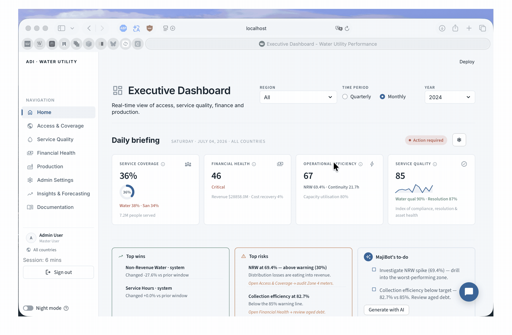
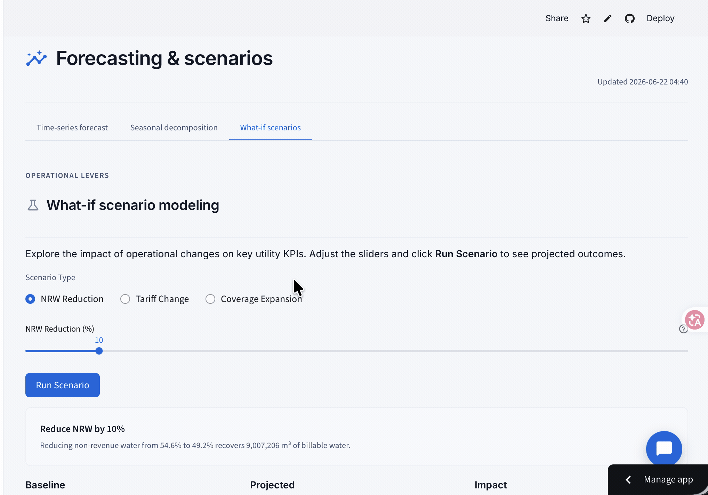
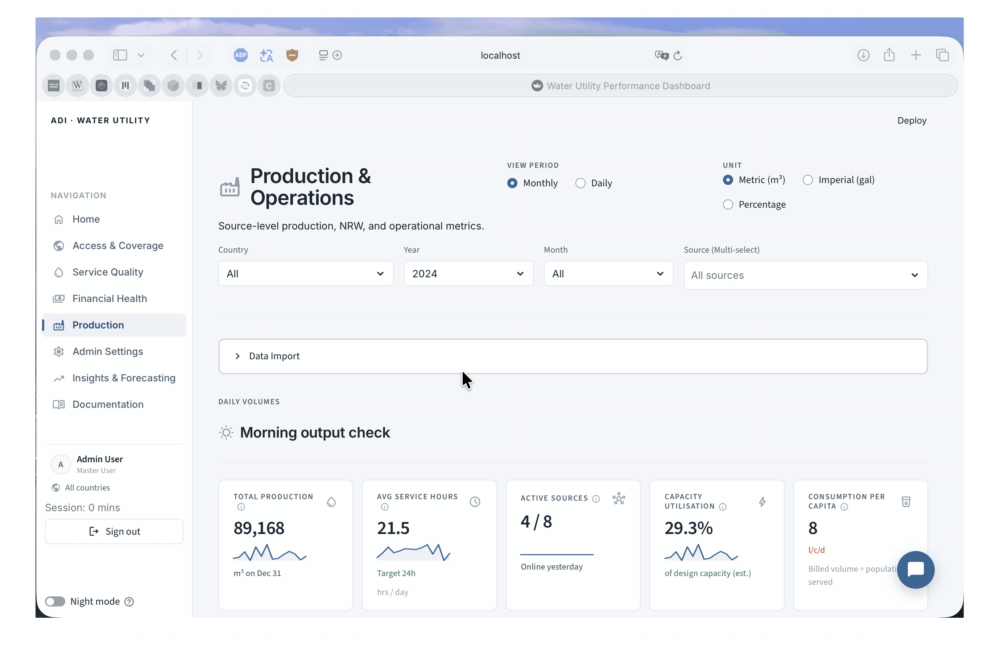
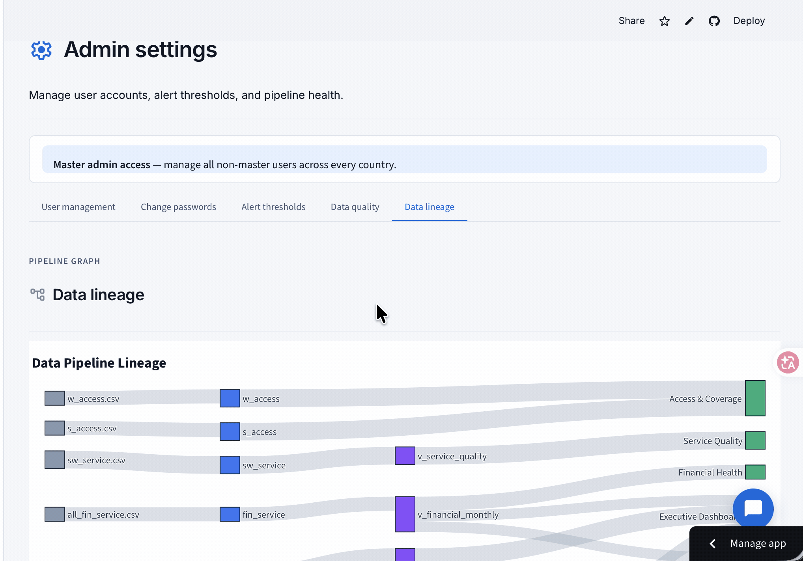
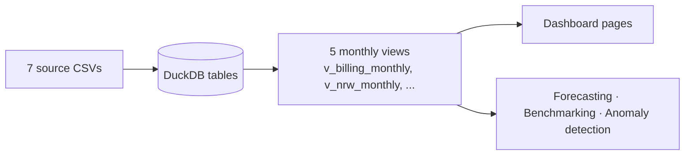

# 💧 Water Utility Performance Dashboard

A role-based analytics platform for water &amp; sanitation utilities — tracking access &amp; coverage, service quality, financial health, and production across countries, with AI-assisted insights and forecasting.


[](https://adi-water-dashboard.streamlit.app)

**[▶ Try the live demo](https://adi-water-dashboard.streamlit.app)** — sign in with `admin` / `admin123`. The first load takes a minute or two while packages install.



---

## Overview

The dashboard turns raw utility CSVs into a single, decision-oriented view of how a water and sanitation utility is performing. It combines secure role-based access, a DuckDB analytical pipeline, and an optional bring-your-own-key AI assistant, at national, city, and zone levels.

It was built as a capstone project with [Athena Infonomics](https://www.athenainfonomics.com) and the Africa Utility Data Collaborative (AUDC), by **Fusion 4** — a team from the Applied Data Institute '25 cohort at [Equitech Futures](https://www.equitechfutures.com/programs/adi).

## ✨ Highlights

- **Five domain pages** — Access &amp; Coverage, Service Quality, Financial Health, Production, and an Executive home page that rolls all four into one headline metric each, plus current risks and wins.
- **Insights &amp; Forecasting** — Holt-Winters time-series forecasts with confidence bands, seasonal decomposition, what-if scenario modelling, and a metric-correlation explorer.
- **MajiBot AI assistant (BYOK)** — an optional chat assistant grounded in the on-screen data, plus AI-drafted board briefs and to-do lists. Supports Gemini, GLM, Grok, OpenAI, DeepSeek, and OpenRouter; degrades gracefully to rule-based output when no key is set.
- **Role-based access** — master, country-admin, analyst, and viewer roles, each scoped to the data they're allowed to see.
- **Cross-country / cross-zone benchmarking** — a peer-comparison radar that narrows from country to zone once a single country is selected.
- **Honest about gaps** — measures that aren't in the data are shown as explicit data-gap panels rather than estimated.
- **In-app documentation** — a built-in reference page explaining every metric formula, the forecasting method, and the data pipeline.

| Forecasting | Production | Admin &amp; users |
|---|---|---|
|  |  |  |

## 🏗️ Architecture

| Layer | Technology |
|---|---|
| Interface | Streamlit (multipage) |
| Analytical storage | DuckDB (embedded, no separate server) |
| Data wrangling | pandas |
| Charts | Plotly |
| Forecasting &amp; decomposition | statsmodels (Holt-Winters, seasonal decompose) |

Data flows in one direction, from raw files to the screens:



On first run the CSVs are loaded into DuckDB tables, then a pipeline builds five pre-aggregated monthly views. Pages read from those views instead of re-scanning raw rows on every rerun, and Streamlit's caching sits on top. Filter selections persist across pages via shared session state.

```
ADI-Water-Dashboard/
├── Dashboard/              # Streamlit application
│   ├── Home.py             # Entrypoint (Executive page + router + MajiBot panel)
│   ├── pages/              # Multipage nav wrappers (Access, Service, Finance, ...)
│   ├── src_page/           # Page render logic (exec, access, quality, finance, ...)
│   ├── data/               # DuckDB layer: pipeline, views, metric registry, lineage
│   ├── analytics/          # Forecasting, decomposition, scenarios, anomaly detection
│   ├── components/         # Benchmarking radar, geo map, PDF export
│   ├── auth.py             # Role-based authentication
│   ├── llm.py              # BYOK LLM client (MajiBot)
│   └── styles.css          # Design-system stylesheet
├── Data/                   # Source CSV datasets
├── tests/                  # pytest suite
├── Dockerfile / docker-compose.yml
└── requirements.txt
```

## 🚀 Quickstart

### Option A — Docker (recommended)

```bash
git clone https://github.com/zerisinyu/ADI-Water-Dashboard.git
cd ADI-Water-Dashboard
docker compose up --build
```

The app is served at **http://localhost:8501**. To enable the AI assistant, pass a key through the environment, for example:

```bash
GEMINI_API_KEY=your_key docker compose up --build
```

### Option B — Local (venv)

```bash
git clone https://github.com/zerisinyu/ADI-Water-Dashboard.git
cd ADI-Water-Dashboard

python -m venv venv
source venv/bin/activate            # Windows: venv\Scripts\activate
pip install -r requirements.txt

streamlit run Dashboard/Home.py
```

Requires **Python 3.11 or newer**.

### Configuring users &amp; AI keys

User accounts and LLM keys come from a Streamlit secrets file (kept out of source):

```bash
mkdir -p Dashboard/.streamlit
cp secrets.toml.example Dashboard/.streamlit/secrets.toml
```

Edit `Dashboard/.streamlit/secrets.toml` to set user accounts and, optionally, an API key under `[llm]`. The shipped example includes four demo users, all with the password `admin123`:

| Role | Username | Scope |
|---|---|---|
| Master user | `admin` | All countries |
| Country admin | `cameroon_admin` | Cameroon |
| Analyst | `analyst` | Uganda |
| Viewer | `viewer` | Malawi |

AI features are **bring-your-own-key**: MajiBot and the AI-written briefs stay hidden until a key is added in the Settings panel, and the dashboard remains fully usable without one. When trying the hosted demo, clear any key you enter at the end of your session.

## 📊 Data

The application auto-loads the CSVs in `Data/` on first run; each page also has a **Data Import** panel for uploading your own file (matching columns) or restoring the sample data.

| File | Feeds |
|---|---|
| `billing.csv` | Billing, collection efficiency, NRW |
| `production.csv` | Production volumes, service hours |
| `sw_service.csv` | Service quality metrics |
| `w_access.csv` / `s_access.csv` | Water / sanitation access ladders |
| `all_fin_service.csv` | Financial services, cost recovery |
| `all_nationalacc.csv` | National budget &amp; governance data |

Full field definitions live in `Data/AUDC Data dictionary.csv`, and an interactive lineage diagram is available in-app under **Admin Settings → Data lineage** and the **Documentation** page.

## 🧪 Development

Run the test suite from the repo root:

```bash
pytest -q
```

`main` is the deployable branch. Work on short-lived feature branches and open a pull request into `main`. For app-level details — page-by-page behaviour, the metric registry, and the design system — see the [Dashboard README](./Dashboard/README.md).

## 👥 Team &amp; acknowledgements

Built by **Fusion 4** (Applied Data Institute '25):

- Sadikshya
- Zhomart
- Sinyu — [@zerisinyu](https://github.com/zerisinyu)
- Akotet — [@Akotet08](https://github.com/Akotet08)

In collaboration with [Athena Infonomics](https://www.athenainfonomics.com), the Africa Utility Data Collaborative (AUDC), and [Equitech Futures](https://www.equitechfutures.com).

> Produced as an academic capstone project. No open-source license is currently attached; please contact the team before reuse.
